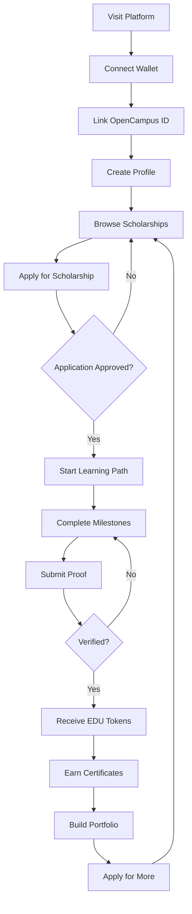
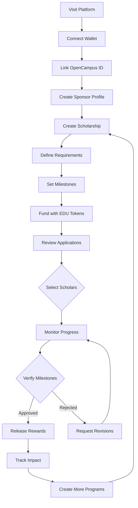

# EduImpact - Decentralized Tech Education Platform

EduImpact is a blockchain-based educational platform that connects tech learners with corporate sponsors through decentralized scholarships. The platform incentivizes learning and skill development in technology fields while providing verifiable credentials through blockchain technology.

## 🚀 Features

### For Learners

- **Milestone-Based Learning**: Progress through structured learning paths with clear milestones
- **Blockchain Rewards**: Earn EDU tokens for completing educational milestones
- **Verifiable Credentials**: Receive NFT certificates for your achievements
- **OpenCampus ID Integration**: Manage your decentralized identity and credentials
- **Progress Tracking**: Monitor your learning journey with detailed progress metrics

### For Sponsors

- **Corporate Sponsorships**: Fund the next generation of tech talent
- **Talent Pipeline**: Connect with skilled learners in your technology domain
- **Transparent Impact**: Track the impact of your educational investments
- **Custom Programs**: Create tailored scholarship programs aligned with your needs

## 🛠 Platform Workflows

### Learner Journey



### Sponsor Journey



## 🛠 Tech Stack

- **Frontend**: Next.js 13+ with App Router
- **UI Framework**: Tailwind CSS with shadcn/ui components
- **Blockchain**: Ethereum/Web3 integration
- **Authentication**: OpenCampus ID (OCID) for decentralized identity
- **Smart Contracts**: Solidity for scholarship and reward management

## 🏗 Project Structure

```
eduimpact/
├── src/
│   ├── app/                 # Next.js app router pages
│   ├── components/          # Reusable React components
│   ├── lib/                 # Utility functions and contexts
│   ├── hooks/              # Custom React hooks
│   └── config/             # Configuration files
```

## 🚦 Getting Started

### Prerequisites

- Node.js 16.8 or later
- MetaMask or compatible Web3 wallet
- OpenCampus ID account

### Installation

1. Clone the repository:

```bash
git clone https://github.com/yourusername/eduimpact.git
cd eduimpact
```

2. Install dependencies:

```bash
npm install
# or
yarn install
```

3. Set up environment variables:

```bash
cp .env.example .env.local
```

Edit `.env.local` with your configuration:

```
NEXT_PUBLIC_OCID_CLIENT_ID=your_ocid_client_id
NEXT_PUBLIC_REDIRECT_URI=http://localhost:3000/redirect
NEXT_PUBLIC_CONTRACT_ADDRESS=your_contract_address
```

4. Run the development server:

```bash
npm run dev
# or
yarn dev
```

5. Open [http://localhost:3000](http://localhost:3000) in your browser

## 🔄 Contributing

We welcome contributions to EduImpact! Please see our [Contributing Guidelines](CONTRIBUTING.md) for details.

## 📄 License

This project is licensed under the MIT License - see the [LICENSE](LICENSE) file for details.

## 🌟 Acknowledgments

- [OpenCampus](https://opencampus.sh/) for OCID integration
- [shadcn/ui](https://ui.shadcn.com/) for the beautiful UI components
- The Web3 community for inspiration and support

Built with ❤️ for the future of tech education with Educhain
